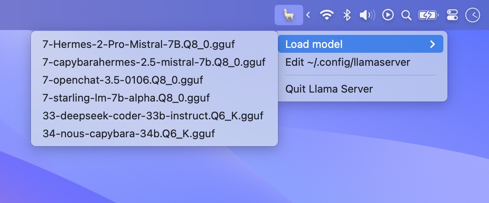
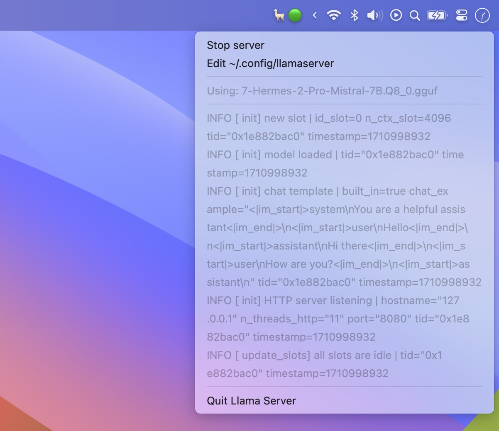

# Llama Server


A Mac menu bar app for controlling [llama.cpp server](https://github.com/ggerganov/llama.cpp/tree/master/examples/server).

Under the hood, this is simply a set of bash scripts wrapped in [Platypus](https://github.com/sveinbjornt/Platypus). It serves as a convenient shortcut to:

- Switch between models using a dropdown menu
- Configure different server flags for different models
- Sandbox llama.cpp with `sandbox-exec`

## Usage

Download it from Releases and drag it into your Applications directory.

The app is currently unsigned, so you'll need to enable it from "System Settings > Privacy & Security".

Click the menu bar icon to create your configuration file (`~/.config/llamaserver/options.sh`). This defines the locations of your [llama.cpp server script](https://github.com/ggerganov/llama.cpp/tree/master/examples/server#quick-start) and models, as well as a list of CLI flags.


Use "Load model" to choose from a list of `*.guff` and `*.model.sh` files from
your configured directory:



While a running `llama.cpp/server` process is detected, the menu will show the last 5 lines of server output. Click "Stop server" to unload the model:



Due to a limitation of Platypus, the menu bar icon doesn't update in the background. You need to click the icon again to get fresh logs.

## Model-Specific Overrides

Create a `*.model.sh` file in your configured models directory to set server flags that only apply to that model. For example:

```bash
LLAMA_SERVER_MODEL_OPTIONS=(
  --model ~/path/to/guff
  --ctx-size 16384
  --chat-template chatml
)
```

## Sandboxing

MacOS ships with an officially-deprecated, poorly-documented, yet heavily-depended-upon sandboxing utility called `sandbox-exec`. Llama Server can optional run llama.cpp with this utility for (plausibly) more security.

You can use the included `example.sandbox.sb` as a starting point, and uncomment the sandbox path to enable this feature.

More information on `sandbox-exec`:

- https://www.karltarvas.com/macos-app-sandboxing-via-sandbox-exec.html
- https://mybyways.com/blog/run-code-in-a-macos-sandbox
- https://reverse.put.as/wp-content/uploads/2011/09/Apple-Sandbox-Guide-v1.0.pdf

## Roadmap

- [x] Set per-model server settings (ex: `ctx-size`)
- [x] Include `sandbox-exec` script
- [x] Support multiple model folders
- [ ] Cache the server script PID for better `pkill` precision
- [ ] Find way to deliver realtime menu bar icon updates
- [ ] Notify when server is ready

## Credits

- [**llama.cpp**](https://github.com/ggerganov/llama.cpp) for the excellent foundation.
- [**Platypus**](https://github.com/sveinbjornt/Platypus) for making wrapper apps easy.
- [**Draw Things**](https://drawthings.ai/) for the spiffy icon.
